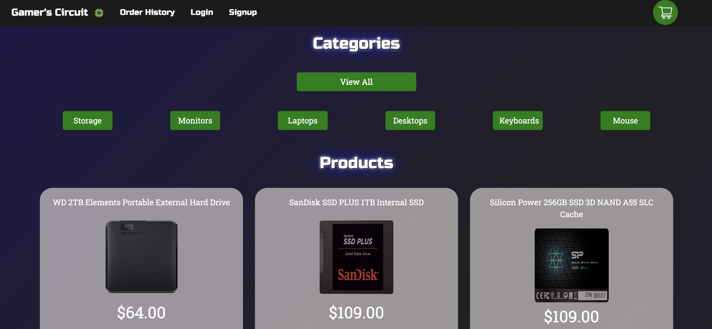
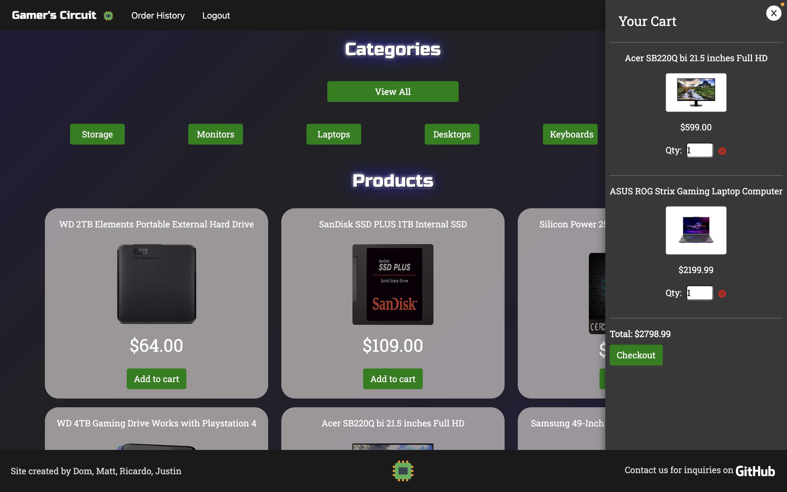
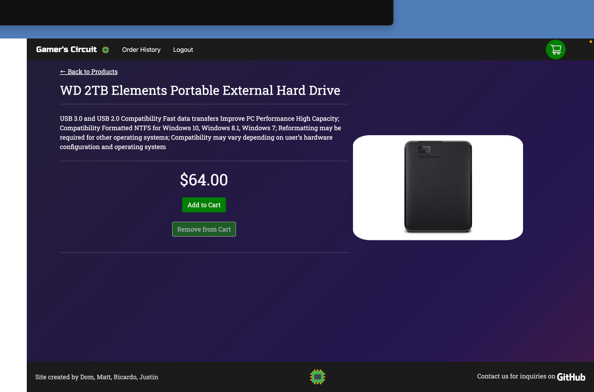
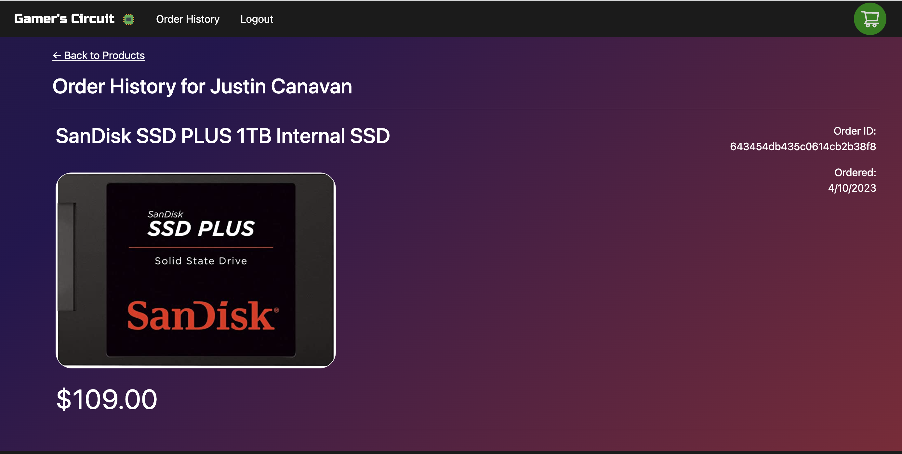

# Gamer's-Circuit
https://github.com//Gamer's-Circuit
[Heroku Live Link](https://shielded-basin-55972.herokuapp.com/)

## Description
An e-commerce app that sells gaming hardware and equipment made with React, Bootstrap, Express, MongoDB, indexedDB, Context API,  JWT, and Stripe. This app is designed to provide a seamless online shopping experience for users who are interested in electronics and hardware. Whether you are a seasoned gaming veteran or are new to the gaming world, Gamer's Circuit is an easy and secure way to get your hands on the latest products.

## Table of Contents
- [Installation](#installation)
- [Usage](#usage)
- [Credits](#credits)
- [License](#license)
- [Contributing](#contributing)
- [Questions](#questions)

## Installation
```npm run seed``` to seed sample data
```npm run develop``` to start app locally

## Usage
Use the site via the [Heroku Live Link](https://shielded-basin-55972.herokuapp.com/)


--------------------

--------------------

--------------------

--------------------


## Credits
Thisapp was created by [Justin Canavan](https://github.com/justincanavanmusic), [Ricardo Rangel](https://github.com/R-Rangel), [Dominic Schnepf](https://github.com/Dschnepf7), and [Matt Osborne](https://github.com/MattOz)


## License
This project is protected by the MIT license.

## Contributing
Contribute via GitHub

## Questions?
If you have any questions, contact us on GitHub:

https://github.com/justincanavanmusic

https://github.com/R-Rangel

https://github.com/Dschnepf7

https://github.com/MattOz